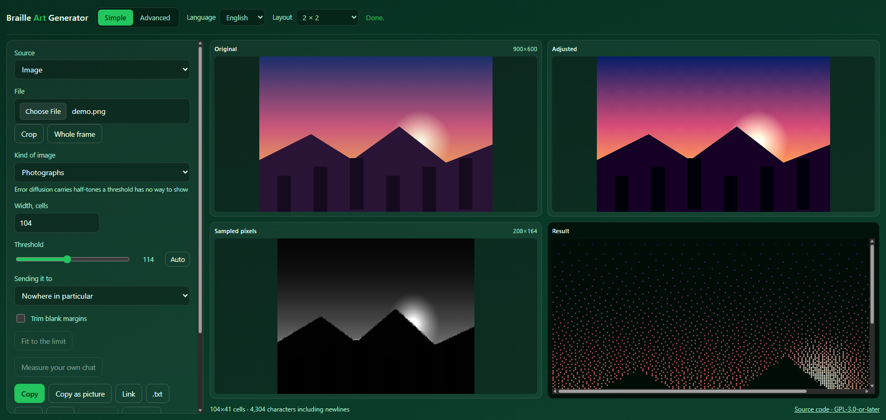

# Braille Art Generator

**Русский** · [English](README.md)

Превращает изображение в текст из символов **Unicode Braille** (U+2800…U+28FF).
Каждый символ кодирует блок 2×4 пикселя, поэтому плотность деталей вчетверо
выше, чем у обычного ASCII-арта.

Работает целиком в браузере: изображение никуда не загружается, сервер отдаёт
только статические файлы.

**[Открыть генератор →](https://jareltis.github.io/braille-art-generator/)**

[](LICENSE)
[](LICENSE-MIT)



---

## Возможности

| | |
|---|---|
| **Детализация** | тонкая структура переживает свёртку, а не усредняется в ничто |
| **Дизеринг** | переменные коэффициенты, Флойд–Стейнберг, Аткинсон, синий шум, Байер 4×4, с необязательным подчёркиванием краёв |
| **Пороги** | глобальный, автоподбор по Оцу и локальный адаптивный (Саувола) |
| **Выделение контуров** | XDoG для штриховой линии, Собель для градиента, плавный переход заливка ↔ линии |
| **Цвет в контурах** | границы между цветами одной яркости, которых по одной яркости не видно |
| **Автоподбор порога** | метод Оцу — по гистограмме тех самых пикселей, которые пойдут в вывод |
| **Коррекция изображения** | яркость, контраст, насыщенность, резкость |
| **Параметры вывода** | ширина и высота в символах, автоподбор высоты по пропорциям, инверсия |
| **Живой пересчёт** | арт обновляется сам, пока сетка не слишком велика |
| **Фоновый поток** | вычисления идут в Web Worker, интерфейс не подвисает |
| **Пресеты** | фото, штриховая графика, логотип, пиксель-арт — каждый выставляет весь набор параметров |
| **Определение вида** | измеряет картинку, выбирает под неё пресет и говорит, к чему пришёл |
| **Палитра** | полный цвет, 256 или 16 цветов терминала, либо несколько из самой картинки |
| **Копирование** | текстом или картинкой — для комнат, где сминается межстрочный интервал |
| **Отправка** | сразу в другое приложение — на телефоне чат находится именно там |
| **На экране** | арт рисуется по точкам, поэтому просветы шрифта и полые кружки в него не попадают |
| **PNG** | рисуется так же и той же функцией |
| **Подбор вариантов** | считает набор рецептов, оценивает каждый, предлагает четыре лучших и говорит, что каждый изменит |
| **Вернуть и повторить** | проводит всю панель по шагам того, что с ней сделала автоматика |
| **Что решено** | действующие автоматические решения и причина каждого |
| **На телефоне** | результат первым, исходники полосой миниатюр под ним, панель ниже |
| **Озвучивание** | арт объявлен картинкой и говорит, что он такое, вместо чтения по точкам |
| **Площадки** | лимит сообщения на виду, копирование в код-блоке, калибровка ширины под свой клиент |
| **Чтобы влезло** | обрезка пустых полей, подбор ширины под лимит, разбивка на несколько сообщений |
| **Цвет** | тонировка ячеек: на экране, в PNG, SVG, HTML и ANSI для терминала |
| **Экспорт** | `.txt`, копирование в буфер, PNG, SVG, HTML, ANSI |
| **Два режима** | простой — пять контролов; расширенный раскрывает всё |
| **Всё на одном экране** | оригинал, коррекция, пиксели сетки и сам арт видны одновременно |
| **Раскладки** | 2×2 по умолчанию, полоса сверху, акцент на арт, один ряд |
| **Источник** | изображение, надпись крупными буквами, камера или рисунок от руки |
| **Загрузка** | файл, перетаскивание, вставка из буфера (Ctrl+V) |
| **Кадрирование** | рамка прямо по превью: тянуть на пустом месте — выделить, внутри — двигать, за угол — менять размер |
| **Правка точек** | дорисовать или стереть отдельные точки прямо по готовому арту, с отменой |
| **Ссылка** | адрес, открывающий генератор с теми же настройками |
| **Клавиатура** | кадрирование, правка точек и рисование работают без указателя |
| **Офлайн** | ставится как приложение и работает без сети |
| **Без бэкенда** | ни одного сетевого запроса после загрузки страницы |

Пустая ячейка выводится как `U+2800 BRAILLE PATTERN BLANK`, а не как пробел —
поэтому арт не разваливается при вставке в чат, где пробелы схлопываются.

### Решать по картинке, а не по её миниатюре

Порядок был такой: уменьшить изображение до сетки, затем по остаткам судить о
каждой точке. То есть данные выбрасывались раньше, чем задавался вопрос. Линия
шириной в один пиксель превращалась в десятую долю уровня серого, и порог её не
видел — на тестовом кадре **не сохранялось ничего**.

Теперь кодировщику отдаётся растр в несколько раз крупнее сетки, и свёртка с
решением происходят вместе: каждый исходный пиксель под точкой посещается, и
точка узнаёт не только среднее, но и крайние значения. Это бесплатно — проход
по всем пикселям всё равно требовался ради среднего.

Кто из них говорит, решается для каждой точки по количеству структуры: отклик
градиента после лёгкого сглаживания. Эта величина отличает настоящую деталь от
шума — на ячейке с однопиксельной линией она около 66, на одном шуме 24–30, на
настоящей границе 115. Разделение примерно в 2.4 раза: опереться можно,
переключать нельзя, поэтому ползунок **«Детализация»** смешивает, а не выбирает.

Что получилось, в измерениях:

| | ровный тон | шум ±50 | линия в 1 пиксель |
|---|---|---|---|
| сначала свёртка (как было) | — | — | **не выживает вовсе** |
| детализация 0 | ±0.4 п.п. | +2.2 п.п. | 3% |
| **детализация 35 (по умолчанию)** | **±0.4 п.п.** | +4.4 п.п. | **100%** |
| детализация 70 | ±0.4 п.п. | +6.7 п.п. | 100% |

Ровный участок не меняется ни при каком значении: фильтр по структуре не видит
там ничего, и среднее остаётся в силе. Плата заметна только на сильном шуме —
около двух процентных пунктов покрытия, — и покупает она возвращённую целиком
тонкую структуру.

Контуры ищутся на том же подробном растре и сводятся к сетке взятием
наибольшего, а не среднего: штрих шириной в пиксель — это и есть смысл карты, из
которой он взят, а усреднение стёрло бы его заново.

### Чем отличаются методы

Порог принимает решение по каждому пикселю отдельно, поэтому ровную заливку в
25% серого он передать не может физически — либо всё, либо ничего. Дизеринг
разменивает точность отдельного пикселя на верную среднюю яркость участка.

- **Флойд–Стейнберг** — распределяет ошибку между четырьмя соседями. Мягкие
  полутона, лучший выбор для фотографий.
- **Переменные коэффициенты** (Островоухов, 2001) — умолчание. Флойд–Стейнберг
  разносит ошибку одинаково при любом тоне, и в светах и тенях это даёт
  коррелированные узоры, которые в цехе называют червями. Эти веса — три соседа
  вместо четырёх — подбирались отдельно для каждого из 128 уровней тона,
  заранее, так чтобы спектр узора оставался близок к синему шуму по всему
  диапазону; выше середины таблица зеркальна. Они взяты из приложения статьи,
  потому что вывести их здесь нельзя. По замерам на четырёх картинках при
  шестидесяти столбцах метод обошёл Флойда на всех: 0.901 против 0.907 на
  пейзаже, 0.841 против 0.852 на лесу — и на этих размерах не стоит ничего
  заметного.
- **Аткинсон** — отдаёт соседям лишь 6/8 ошибки. Остальное теряется намеренно:
  света и тени уходят в клиппинг вместо размазывания, и на грубой сетке это
  читается контрастнее.

Оба они разворачиваются в конце строки, а не возвращаются в начало. Диффузия
ошибки, всегда идущая в одну сторону, оставляет и саму ошибку сносящейся туда
же, и этот снос виден тонкой горизонтальной полосатостью в полутонах — на склоне
горы её отлично заметно, склоны выходили расчёсанными. Чередование направления
гасит снос от строки к строке и не стоит ничего. По замерам оценка относительно
оригинала выросла с 0.890 до 0.901 на пейзаже и с 0.943 до 0.949 на рисунке, а на
графике упала на 0.002; полосатость — это то, что видно глазом.
- **Байер 4×4** — упорядоченный дизеринг, ошибка между пикселями не ходит
  вовсе. Регулярная сетка вместо органического зерна, и результат зависит
  только от координат.
- **Синий шум** — тоже упорядоченный, но плитка порогов построена алгоритмом
  void-and-cluster: пороги разложены так, что ни на одном масштабе нет
  повторяющейся структуры. Получается фактура диффузии при позиционной
  независимости Байера.

У обоих упорядоченных методов плитка **и есть** лестница порогов во весь
диапазон: ровное значение оказывается выше стольких ступеней, сколько оно само,
и покрытие получается равным значению. Ползунок порога сдвигает эту лестницу, а
не стоит в её середине: обратной связи по ошибке здесь нет, поправить смещение
нечем. Именно так они и уехали на девять версий после перехода тона в линейный
свет — ровный средний серый выходил с покрытием 81% вместо 50%, тогда как
диффузия ошибки тот же переход прошла незаметно, потому что исправляет себя
сама.
Ползунок **«Подчеркнуть края»** наклоняет порог у края — приём Эшбаха и Нокса:
из порога вычитается масштабированная высокочастотная часть картинки, так что
пикселю со светлой стороны края легче зажечься, а с тёмной труднее. Одно
умножение и одно сложение на пиксель.

Это контрол, а не умолчание, потому что две его стороны тянут в разные стороны.
По измерениям оценка относительно оригинала падает с 0.89 до 0.86 по мере
усиления — приём намеренно менее верен свету. Взамен он даёт читаемость,
которой эта оценка не видит: на графике с надписью слово читается при силе 1 и
расплывается при 0. И то и другое смотрел глазами. Пресет «логотип» включает его,
потому что именно на этом случае он и мерялся.

Работает только у методов, передающих ошибку соседям. Они меряют ошибку
относительно истинного значения, что бы ни решил сдвинутый порог, — и окрестность
возвращает тон на место. У упорядоченной плитки такой второй попытки нет: сдвиг
её порога сдвигает тон, и вернуть его нечем, — ровно та ловушка, в которую
упорядоченные методы уже попадали однажды. При выборе метода, который так не
умеет, ползунок гаснет.

- **Локальный порог (Саувола)** — порог считается по окрестности каждого
  пикселя, а не по всему кадру. Единственное число не может обслужить фото,
  освещённое с одной стороны: каким бы оно ни было, один край кадра погибнет.
- **Простой порог** — для логотипов, текста и штриховой графики, где дизеринг
  только добавляет шум.

### Почему считается в двух разных пространствах

Покрытие точками линейно по свету: половина зажжённых точек излучает половину
света, поэтому доля точек, воспроизводящая тон, — это **линейная** яркость
этого тона. Диффузия ошибки по гамма-кодированным значениям (так делает
большинство подобных конвертеров, и так делал этот до 0.9) сохраняет среднее не
той величины и систематически осветляет результат: ровный серый sRGB 128
раскладывался с покрытием 0.50 вместо правильных 0.22.

А контуры — наоборот. Разность гауссиан отвечает на кривизну, и линейная
яркость плавного визуального градиента сильно выпукла: на пяти равных шагах
sRGB её приращения различаются в 9.2 раза, тогда как у перцептивной светлоты
L* — в 1.2. Запущенный в линейном пространстве XDoG объявлял контуром весь
градиент целиком.

Поэтому плоскость, которую пороговит кодировщик, линейна для тона и
перцептивна для линий, а `tonePlane()` решает какая и сообщает об этом. Ползунок
порога остаётся в sRGB, чтобы его середина была серединой того, что видит
человек, и переводится один раз — там, где выбрана плоскость.

### Контуры

По умолчанию точка ставится там, где ярко. Для рисунков, аниме-кадров, чертежей
и мемных шаблонов это часто даёт кашу: важна не яркость, а линия.

- **XDoG** — разность двух гауссиан с мягким порогом. В отличие от градиента,
  отклик уходит в минус только с тёмной стороны границы, поэтому получается
  односторонний штрих переменной толщины, а не полоса по обе стороны контура.
  Именно эта переменная толщина хорошо ложится на сетку 2×4.
- **Собель** — модуль градиента. Быстрый и предсказуемый, но отвечает на вопрос
  «насколько здесь круто», так что склон отзывается по всей своей ширине: по
  измерениям — четыре пикселя на резкой границе и одиннадцать на той, что гаснет
  за восемь. Остаётся только гребень. Точка выживает, если она не слабее двух
  соседних *вдоль* склона, а сами эти соседи берутся интерполяцией, а не
  округлением направления до восьми румбов, — именно это оставляет диагональ
  линией, а не пунктиром. Обе полосы возвращаются шириной в пиксель и с той же
  силой, что была.

  Прореживание теперь важнее, чем раньше. Карты линий сводятся к сетке взятием
  наибольшего значения в ячейке — усреднение стёрло бы тот самый штрих, ради
  которого карта и считалась, — поэтому полоса раздаёт свой пик каждой точке,
  которой коснулась, и одиннадцать пикселей склона превращались в три точки
  сплошной заливки там, где была одна линия.

Ползунок **заливка ↔ линии** смешивает контуры с яркостью до дизеринга: рисунок
может сохранить светотень и одновременно получить чёткие края.

Оба детектора отзываются на текстуру не менее охотно, чем на границу, и одним
порогом их не разделить: травинка и правда является резким маленьким контуром.
Ползунок **«Чистка»** разделяет их не по силе, а по соседству: самые сильные
отклики становятся зёрнами, а более слабый остаётся только там, где от него
можно проследить путь до зерна. Контур — это слабый участок, продолжающий
сильный; текстура — крапина, у которой соседи такие же крапины.

По измерениям на шести фотографиях и рисунках: на склоне горы чернил становится
вдвое меньше — 37% кадра против 18%, — а медианная длина связного штриха растёт
с 12 пикселей до 30: меньше чернил, но длиннее линии. На чистой графике
крапчатый фон исчезает полностью, надпись остаётся нетронутой, а число
отдельных кусков падает с 280 до 58.

Это было верно с самого начала. Чего приём не умел — отделить контур от текстуры
**той же силы**: травинка и правда резкий перепад, и ни порог, ни связность их не
различают. Эта брешь теперь закрыта другим вопросом: не «насколько сильны эти
чернила», а «смотрят ли они туда же, куда соседи».

Отвечает **тензор структуры**. Произведения компонент градиента сглаживаются в
маленькую матрицу в каждой точке, и то, насколько разошлись её два собственных
числа, говорит, вся ли энергия здесь направлена в одну сторону. Граница толкает
её в одну сторону и отвечает около 1; текстура толкает во все сразу и отвечает
около 0. По замеру на прямой границе, утопленной в крапинах той же силы: 0.72 на
границе против 0.02 в текстуре — разрыв в тридцать четыре раза там, где обычный
градиент давал 2.4. По чернилам, которые XDoG кладёт на фотографию, самая
когерентная десятая часть стоит примерно в двенадцать раз выше самой слабой.

Поэтому чистка задаёт оба вопроса, и именно в этом порядке: сначала пригасить то,
насчёт чего окрестность не согласна, затем оставить сильное или примыкающее к
сильному. Зёрна выбираются из уже отсуженных чернил, а не из того, что случайно
оказалось ярче; выжившему возвращается та сила, которую дал детектор, — штрих
настолько тёмный, насколько заслужил.

На пейзаже при шестидесяти столбцах это уводит число отдельных кусков чернил с
1001 до 493, а медианную длину связного штриха — с 30 пикселей до 61; на рисунке
с 68 кусков до 27 и с 57 пикселей до 161. Меток меньше, и они длиннее.

Бесплатным это не будет. Три размытия под тензором структуры — самая крупная
статья расходов во всём контурном пути: 744 мс из примерно 800 на растре в два
мегапикселя против 21 мс у следующего за ним гистерезиса. Три способа удешевить
измерены, и ни один не взят. Половинное разрешение вчетверо быстрее и сдвигает
30% зажжённых точек. Коробочные размытия вместо гауссова вдвое быстрее и меняют
саму когерентность на 0.07–0.14 по шкале до единицы. А рекурсивный гауссиан —
Янг и ван Влит, горстка операций на пиксель независимо от σ — быстрее размытия
в четыре-восемь раз и держит ровное поле точно ровным, но при сравнении с
правильно посчитанным гауссианом, а не с нашим же приближением, оказывается
менее точным примерно всемеро: хвосты у него вдвое тяжелее, чем следует. Для
тензора, у которого весь вопрос в том, как далеко простирается согласие, это
неверная ошибка; он сдвигал 1.4–3.1% зажжённых точек ради экономии половины
времени на этом пути, тогда как обрезанный прямой фильтр и так укладывается в
половину уровня от идеала в худшем случае. Цену вместо
этого несёт темп: пересчёт, ставший слишком долгим, чтобы поспевать за
ползунками, перестаёт за ними поспевать и говорит об этом.

Два других подхода были измерены и отброшены. Окружающее торможение выедает
штрих изнутри — сильный штрих сам себе окружение, — а кольцевая форма, которая
этого избегает, на фотографии не убирает почти ничего: под контуром кольцо
занято ровно так же, как везде. Разность гауссиан вдоль потока (FDoG) была
запланирована, отброшена, а позже всё-таки построена и измерена. В первый раз её
отбросили потому, что она лечит разорванные контуры, а измерение показало
обратную беду: 93–97% чернил XDoG и так лежали в длинных штрихах. К ней
вернулись, когда появился тензор структуры, — он даёт нужное FDoG поле
направлений даром, — и измерили как следует, с одинаковой чисткой у обоих, чтобы
не сравнивать прибранное с неприбранным.

Вышел скромный выигрыш на фотографии — 342 отдельных куска чернил против 493 и
медианный штрих 86 пикселей против 61 при том же количестве чернил — и никакого
на рисунке, который чищеный XDoG и так свёл к 27 кускам. Рядом две картинки
почти неразличимы. Детектор при этом дороже в восемь раз. Оба метода опираются
на один и тот же факт — у края есть направление; раз дешёвый способ им
воспользоваться уже взят, дорогой добавляет слишком мало, чтобы себя окупить.
Это приговор прибавке здесь, а не методу: без гашения по когерентности его,
скорее всего, стоило бы построить.

#### Граница, которой не видно в свете

Всё сказанное выше читает яркость, а яркость — не всё. Два цвета могут быть
одного веса света и при этом не иметь между собой ничего общего: зелёный
континент на синем глобусе, красная надпись на зелёном поле. По замеру такая
граница двигает плоскость светлоты на 1 часть из 255, детектор отвечает 7 из 255,
и арт получает **ноль чернил** — фигура попросту отсутствует на картинке, где она
очевидно есть.

Флажок **Смотреть и на цвет** запускает тот же детектор по двум цветовым осям
L\*a\*b\* и сводит три карты взятием наибольшего — так здесь сводятся все карты
линий: усреднение стёрло бы границу, которую видит только один канал, а ради неё
всё и затевалось. Оси масштабируются тем же множителем 2.55, что и плоскость
светлоты: в L\*a\*b\* шаг на единицу по любой оси задуман примерно равным по
заметности шагу на единицу по любой другой.

Цвет перед этим размывается — вчетверо шире собственного радиуса детектора.
Цветовая острота зрения — доля яркостной, именно поэтому JPEG с 1992 года
выбрасывает три четверти цветового разрешения, — так что мелкая цветовая деталь
не деталь, а шум, в котором нечего искать. По замеру на шести тестовых картинках
размытие и делает градиентный детектор пригодным: без него чернил становится
больше в 1.9–3.3 раза, с ним — в 1.05–2 раза. Штриховой детектор задет меньше,
его собственное размытие часть шума уже съело: 2.0–2.6 против 1.6–2.5. Четвёрка
— та середина, которая держится: на восьмёрке фотографии успокаиваются ещё
сильнее, но равнояркая граница отвечает 40 из 255 вместо 146, а на двойке шумят
оба детектора.

Гашение по когерентности читает те же каналы — но по причине более узкой, чем
показалось сначала. Прямая цветная граница отлично направлена и в яркости: при
шаге светлоты 0.007 гашение всё равно отвечает 1.000, так что выбрасывать там
было нечего. Чего яркостный тензор действительно не может рассудить — это цветной
штрих, лежащий на яркостной крапине: штриху он отвечает 0.004, потому что вокруг
шум, направленный во все стороны, тогда как три канала вместе отвечают 0.376.
Поэтому при включённом цвете тензор суммирует произведения по трём каналам —
форма Ди Дзенцо, без единого лишнего размытия, — и чистка сохраняет тот же штрих,
унося с собой на пятую часть больше крапин. На шести тестовых картинках это
двигает 0.8–5.5% чернил.

На той самой равнояркой границе это поднимает ответ с 7 до 146 из 255, а арт — с
нуля чернил до линии. На картинке без цвета оси нулевые, и не меняется ничего:
это проверяется тестом. На фотографии чернил всё же прибавляется, поэтому по
умолчанию флажок выключен, а пресет «штриховая графика» его включает; подбор
вариантов считает его ещё одной ручкой, которую стоит попробовать. Стоит это
1.6–2.3 цены контурного пути — ровно то, что темп уже умеет поглощать.

### Арт рисуется, а не набирается

Брайлевый глиф не заполняет отведённое ему знакоместо. По замеру в собственном
стеке шрифтов этого приложения полностью залитая ячейка занимает 26 пикселей из
37.5 пикселей ширины: почти треть каждой ячейки пуста, и картинка выходит
разлинованной вертикальными просветами, которые принадлежат шрифту, а не арту.
Терминалы, которые показывают брайль хорошо, — kitty, iTerm2, Ghostty, Konsole,
VS Code — рисуют эти глифы сами именно по этой причине. Некоторые шрифты хуже,
чем просто с отступами: они рисуют непогашенные точки полыми кружками, и картинка
покрывается дырами, которых в ней не было.

Очевидное решение здесь неверное. Отрицательный межбуквенный интервал стянул бы
буквы и выровнял решётку, но заодно сделал бы ячейку уже, чем она есть: просвет —
это отсутствие чернил, а не более узкий символ, и все терминалы, которые рисуют
эти глифы хорошо, заполняют ячейку, не меняя её ширины. Сжать текст — значит
спрятать косметический изъян ценой настоящего: пропорция глифа, из которой
выводятся число строк, раскладка и оба экспорта, начала бы врать.

Поэтому ячейка сохраняет ширину, которую даёт шрифт, а точки рисуются внутри
неё: две поперёк и четыре вдоль, каждая в середине своей четверти, — так что
расстояние внутри ячейки и расстояние между ячейками это одно и то же число. Так
всегда писался PNG; с 0.35 то же самое показывает и страница, причём одной и той
же функцией, так что разойтись им не на чем. Текст никуда не делся и лежит под
рисунком — это он выделяется, копируется, правится по точкам и читается вслух, —
и на время рисунка отдаёт только свой цвет; стоит что-нибудь выделить, и рисунок
уходит в сторону, чтобы подсветку было видно. Флажок **Рисовать точки ровно**
выключает всё это — для тех, кто предпочитает видеть ровно то, что делает
их собственный шрифт.

Рисуется только видимое окно: полное окно 900×700 обходится в 3.6 мс — работа
масштаба прокрутки, а не пересчёта. На мелком кегле точка рисуется квадратом, а
не кругом, — не потому что квадрат чётче (равный по площади даёт тот же пик), а
потому что при радиусе около пикселя круг почти целиком состоит из собственного
сглаженного края, и арт сереет. В ячейке четыре на восемь пикселей круглые точки
кладут 4016 чернил, а квадратные — 5760.

SVG остаётся текстом, и это осознанно: сетка 400×400 держит до 1.28 миллиона
точек, а нарисованные поштучно, они дают файл, который никто не откроет. Текстом
это несколько килобайт, и он остаётся выделяемым и правимым — ценой того, что
отрисуется он тем моноширинным шрифтом, какой окажется у зрителя, вместе со
всеми просветами. Об этом там сказано полностью. Это единственный выход, который
до сих пор набирается, а не рисуется.

### Для того, кто его не видит

Сам по себе скринридер читает арт как последовательность брайлевых узоров —
несколько тысяч подряд, номерами точек. Для приложения, которое делает картинки
из брайля, это хуже, чем бесполезно: хуже всех приходится тем, кто читает брайль
по-настоящему.

Поэтому арт говорит, что он такое: `role="img"` и описание, собранное под этот
арт, а не оставленное в разметке, — откуда картинка, какого размера сетка,
сколько знаков. Сами знаки после этого пропускаются, а не зачитываются. Счёт
знаков идёт в формах числа самого языка: по-русски 21 берёт единственное.

Пока правятся точки, роль снимается: тогда это уже не картинка, а вещь, над
которой работают, и описание говорит, какие клавиши перемещают, а какие
переключают. Строка состояния и так живая область, поэтому каждая правка
объявляется по ходу дела.

Одного это не чинит, и стоит сказать прямо: арт, вставленный в общий чат,
доходит до того, кто читает этот чат на брайлевом дисплее, шумом. Если комната
не ваша, строчка описания рядом — простая вежливость.

### На маленьком экране

Ниже 900 px страница перестаёт держать четыре панели разом и начинает
прокручиваться. Это было и раньше; неверным было другое — прокручивалась она в
порядке разметки, и арт оказывался под всей панелью настроек. По замеру на экране
390×844 результат начинался на **2163-м пикселе**: две с половиной прокрутки мимо
всех контролов, на том самом устройстве, с которого чаще всего и делятся.

Теперь результат идёт первым, а три исходных вида превращаются в полосу миниатюр
под ним, а не в три полноразмерные панели: они нужны для проверки, а не для
разглядывания. В диапазоне 620–900 px — альбомный телефон, планшет — контролы
раскладываются в две колонки вместо одной стопки полей во всю ширину.

Второго интерфейса при этом не появилось: это та же разметка в другом порядке —
то же правило, по которому живут режимы «Простой» и «Расширенный».

Кнопка **Поделиться** — из этого же экрана. На телефоне чат лежит не в буфере
обмена, а за окном отправки, поэтому арт уходит в другое приложение сразу
картинкой — нарисованной, чтобы шрифт принимающей комнаты до неё не дотянулся.
Браузеру, который делится текстом, но не файлами, достаётся сам арт текстом, и
строка состояния говорит, что из двух ушло: назвать отправкой картинки уход
текста было бы враньём. Там, где окна отправки нет вовсе, кнопки просто нет —
лучше, чем кнопка, которой нечем ответить.

Картинка собирается через `toDataURL`, а не через более аккуратный `toBlob`:
отправка должна случиться, пока ещё засчитывается породившее её касание, а на iOS
ожидание между этими двумя моментами его теряет.

### Офлайн — и при этом не вчерашний

Приложение статическое и без бэкенда, поэтому вся оболочка кладётся в кеш и
оттуда же и отдаётся: это и даёт работу без сети, и открывает мгновенно.

Остановиться на этом было ошибкой с длинным хвостом. Кеш ключуется версией,
вписанной в сервис-воркер руками, а браузер переустанавливает воркер, только
если изменился сам файл. Значит, релиз, не тронувший ни одного модуля, оставлял
без изменений и воркер, и кеш — и человек с установленным приложением продолжал
получать ту оболочку, которую закешировал впервые. Эту строку записали один раз
и больше не трогали: двадцать релизов, из последних семи пять не задели ничего,
что воркер бы заметил. И нигде об этом не говорилось.

Теперь защиты две, потому что в каждой поодиночке есть дыра. Версия живёт в
`src/version.js`, показывается в разделе «Что решено», и набор тестов падает,
если воркер с ней не согласен, — забытое обновление ломает сборку, а не
пользователя. А отданный из кеша ответ следом тихо обновляется, так что даже
воркер, который никогда не меняется, не сможет отдать позапрошлое приложение
дважды. Целая загрузка страницы по-прежнему берётся из того, что лежало в кеше
на её начало, — набор модулей в одной загрузке согласован, а новые вступают в
силу со следующего захода.

### Говорить, что решено

За человека теперь решается немало: вид картинки и следующий из него пресет,
порог, если позвали Оцу, как чистятся линии, поспевает ли пересчёт. Каждое из
этих решений объявлялось один раз в строке состояния — и исчезало.

Раздел **«Что решено»** перечисляет их в настоящем времени, как состояние, а не
как журнал: вид картинки и найден он или выбран, порог и кто его поставил —
Оцу или рука, цепочку от пикселей исходника через подробный растр к сетке,
поспевает ли пересчёт и сколько стоил последний, и что делает чистка. То, чего
приложение не решало само, так и говорит — пропущенная строка читалась бы как
неисправность.

Чтобы это стоило иметь, оно должно быть точным. Написание раздела и поймало,
как приложение приписывало Оцу порог, выставленный пресетом: флаг, помнящий
происхождение числа, сбрасывался только при движении ползунка рукой.

Рядом — клавиши: **Ctrl+Enter** пересчитывает, **Ctrl+Shift+C** копирует. Простое
Ctrl+C намеренно оставлено в покое: забрать его — сломать копирование из поля
надписи, а везде оно значит одно и то же.

### Поспевать за ползунками

Арт пересчитывается прямо на ходу — до того места, где пересчёт перестаёт
ощущаться пересчётом. Раньше этим местом было число клеток, двести на двести,
выбранное на одной машине. Для этого вопроса это неверная единица: одна и та же
сетка занимает меньше полусекунды на ноутбуке и несколько секунд на телефоне.
Теперь ответ берётся из того, сколько стоил последний пересчёт, пересчитанного
на нужный размер. Дизеринг проходит каждую точку один раз, так что зависимость
цены от числа клеток достаточно близка к прямой, а оценке нужно лишь угадать, по
какую сторону от полусекунды мы окажемся. Между «перестал поспевать» и «снова
поспевает» оставлен зазор — иначе сетка, стоящая ровно на границе, включала бы и
выключала слежение через нажатие.

Важнее самой оценки то, что пересчёты выстроены по одному. Объединение по кадру
склеивает события одного кадра и позволяет следующему кадру начать новый
пересчёт независимо от того, закончился ли прошлый, — и протяжка ползунка
ставила в очередь по пересчёту на кадр, каждый из которых воркер считал целиком,
а страница затем выбрасывала как устаревший. Теперь запрос, заставший работу в
ходу, лишь оставляет пометку, а настройки читаются заново, когда до неё дойдёт
черёд. По замерам на пейзаже: 380 мс на сетке 200×150 и 640 мс на 300×225.

### Шаг назад

Три вещи переписывают всю панель разом: выбор пресета, определение вида картинки
и принятый вариант из предложенных. **«Вернуть»** и **«Повторить»** проводят по
этим шагам, восстанавливая настройки целиком, а не отдельные ползунки, — потому
что именно настройки целиком эти действия и заменяют.

Ими же сравниваются два арта: шаг назад, посмотреть, шаг вперёд. Это выбрано
вместо «подсмотреть, пока держишь»: тот показывал бы один арт, пока панель
описывает другой, и отдал бы не то тому, кто в этот момент нажал «Копировать».

Ctrl+Z и Ctrl+Shift+Z делают то же самое — кроме случая, когда идёт правка
точек: там это сочетание принадлежит точкам, ведь рука занята ими.

### Подбор вариантов

Комбинаций у ползунков больше, чем кто-либо станет перебирать руками, и какая
подойдёт конкретной картинке — неочевидно даже тому, кто знает назначение
каждого. Кнопка **«Подобрать»** считает набор вариантов, оценивает каждый по
картинке и выкладывает четыре лучших. Пока вариант не выбран, ничего не
применяется; Esc оставляет всё как было, вплоть до строки состояния.

Набор не перечислен заранее, а разыгрывается, — поэтому нажать второй раз имеет
смысл. Разыгрывать свободно по всему пространству параметров значило бы получать
в основном мусор, поэтому розыгрыш идёт внутри **семейств** — это способы
работы, а не наборы настроек: вести полутона, класть ровное зерно, резать по
контрасту, рисовать линии, смешивать линии с тоном. Из какого семейства плитка —
решается первым, случайны только его ручки: метод внутри семейства, детализация,
радиус и вес контура, а также порог в пределах примерно двадцати уровней от
текущего.

Рисунок судят другим вопросом, потому что он на другой вопрос и отвечает. По
свету каждый линейный вариант выходил ровно в 0.00 — свет это единственное, чего
линейный рисунок не воспроизводит, — и за 48 розыгрышей на четырёх картинках его
не предложили ни разу, в версии сразу после той, что эти линии и сделала
хорошими. Поэтому рисунок мерят по тому, куда легли чернила: точность и полнота
относительно контуров самой картинки, сведённые в одно число. Шкалы оказались
соизмеримыми, хотя их к этому не подгоняли, — рисунки берут 0.88–0.96 по своей
мере там, где тональные берут 0.84–0.94 по своей, — но их не гоняют наперегонки:
это ответы на разные вопросы. Ранжирование по свету остаётся правилом дома, а
рисунок занимает одно место, заслужив его: он обязан найти контуры лучше, чем их
уже находит лучший тональный кандидат. На гладком градиенте, где рисовать нечего,
он не занимает места вовсе.

Локальный порог был семейством и перестал им быть. Его назначение — выбросить
освещённость, чтобы содержимое читалось, а это противоположность воспроизведению
картинки, так что ни одна из мер его не поощряет: по замерам он не занял места ни
разу, в том числе на картинках, намеренно освещённых с одной стороны. Семейство,
которое нельзя предложить, — обещание, которого этот список не держит. Саувола
по-прежнему выбирается вручную, а его окно теперь восьмая часть меньшей стороны
вместо шестнадцатой: по замерам на трёх картинках прежний радиус был стабильно
тесен и стоил пейзажу 28%.

Дальше четыре места достаются четырём **разным** семействам, насколько это
удаётся, — именно это не даёт нажатию превратиться в один инструмент четыре раза
с чуть сдвинутыми ручками. Это стремление, а не обещание: семейство занимает
место, только если набрало не меньше 55% от лучшего на столе, а на некоторых
картинках столько набирают лишь три — тогда четвёртое место уходит следующему по
счёту, а не тому, что никто не выберет. По измерениям на шести картинках и двух
ширинах четыре разных семейства выходили в 33 розыгрышах из 36, а слабейшая
показанная плитка ни разу не опускалась ниже 58% от лучшей. Одно нажатие стоит
восемнадцати кодирований — меньше секунды в фоновом потоке на этих размерах.

Оценка устроена так же, как это делает человек, — отклонившись назад. Вблизи арт
это поле точек; издали точки сливаются, и картинка либо есть, либо её нет.
Поэтому точки превращаются обратно в свет, обе стороны размываются примерно так,
как это делает глаз с расстояния чтения, и сравниваются. Честным это сравнение
делает покрытие: половина поднятых точек излучает половину света — ту же
линейную величину, в которой измеряется и фотография.

У сравнения две половины, и они перемножаются, чтобы ни одна не вытянула
кандидата в одиночку:

- **Структура** — структурное подобие по окнам 8×8: верно ли среднее, верен ли
  размах, меняются ли обе стороны согласованно.
- **Тон** — обычная разница между размытыми полями.

Одной структуры мало, и причину стоит назвать. На ровном участке SSIM хвалит
отсутствие структуры, а у равномерно неверного её тоже нет: жёсткий порог
превращает ровный средний серый в сплошное поле — ошибка покрытия 57 п.п., — и
одно структурное подобие всё равно ставило ему 0.73.

Ещё две величины измерены, а не назначены. Размытие взгляда — 1.6 точки: меньше
одной точки сравнение начинает разглядывать отдельные точки и премировать тот
метод, у которого они случайно легли на нужные пиксели, и порядок переворачивается
целиком; больше трёх — видит только среднюю яркость и перестаёт замечать, есть ли
там вообще картинка. А четыре предложенных обязаны отличаться друг от друга не
менее чем на 4% точек, иначе картинка, которой идут сразу несколько рецептов,
потратит все четыре места на одно и то же изображение с разным зерном.

На шести фотографиях и рисунках, на ширинах 40 и 60, диффузия ошибки выигрывает
или идёт вровень везде — 0.94 на рисунке, 0.89 на пейзаже, — а упорядоченный
дизеринг и синий шум отстают на тысячные там, где картинка самая плоская. То
есть умолчание таково, каким его и показывают числа, а плитки нужны для тех
случаев, когда картинка с ним не согласна.

Ранняя редакция этого раздела утверждала обратное — на основании измерения через
стенд, у которого была своя копия вызова кодировщика. Копия передавала
детализацию в единицах ползунка там, где кодировщик ждёт долю: каждый кандидат
считался с силой 35 вместо 0.35, а это расплющивает диффузию ошибки в сплошные
пятна и переворачивает порядок. Теперь стенд ходит через ту же функцию, что и
приложение, — только так это и остаётся правдой.

### Меньше цветов, намеренно

Цвет уходит отсюда в две стороны, и обеим нужна одна и та же операция. У
терминала бывает всего 256 записей или 16, и отправка двадцатичетырёхбитных
кодов туда, где их не читают, деградирует не мягко: управляющие
последовательности печатаются как текст. Вторая сторона — вкус: картинка,
срезанная до восьми цветов, читается как намеренная вещь, а не как фотография,
которая что-то потеряла.

Поэтому здесь один контрол и один путь исполнения. Отличается только то, откуда
берётся палитра: у терминала она фиксированная, иначе — выводится из самой
картинки медианным срезом. Ячейки привязываются к палитре сразу на входе, до
того как их увидит что-либо ниже по течению, так что экран, HTML, PNG, SVG и
терминал не могут разойтись во мнении о цвете ячейки.

Ближайший цвет ищется в **L\*a\*b\***, а не по расстоянию между числами sRGB.
Прямое расстояние в RGB считает шаг в тёмно-зелёном таким же, как шаг в бледно-
жёлтом, а глаз так не считает. Это простая формула CIE76, без позднейших
уточнений: при выборе из 256 фиксированных записей разница между ними не видна.
Медианный срез делит по каналам sRGB, как и предполагает метод, но усредняет
каждую коробку в линейном свете — усреднение гамма-кодированных каналов даёт
систематически слишком светлый результат, ту же самую ошибку, ради которой
писался весь путь дизеринга.

В палитре xterm есть дубликаты — запись 16 это снова чёрный, 231 снова белый, —
и при ничьей побеждает меньший индекс, что и лучше: простые шестнадцать понимают
везде.

PNG и SVG можно выгрузить на прозрачном фоне.

### Что это за картинка

Выбрать между пресетами — значит знать, какой подходит, а это вопрос про
картинку, а не про того, кто её принёс. Пункт **«Определить самому»** измеряет
картинку, применяет подходящий пресет и говорит, к чему пришёл: это догадка, а
догадку надо иметь возможность переспорить.

Работают четыре измерения, и каждый порог стоит посреди измеренного зазора, а не
вплотную к его краю:

- **Повторяющиеся столбцы.** Пиксель-арт почти всегда показывают увеличенным, а
  увеличение без сглаживания дублирует каждый столбец: 96% столбцов, и 88% даже
  после того, как файл прошёл через JPEG. Логотип из плоских фигур даёт 54%,
  штриховой рисунок — 21%, шесть фотографий — 0–6%.
- **Края шкалы.** Тушь на бумаге живёт у чёрного и белого: 77% логотипа и 90%
  штрихового рисунка лежат у одного из краёв, против 2–37% у всего
  фотографического.
- **Сколько отвечает сильно.** Это отличает рисунок от логотипа, когда уже
  известно, что перед нами тушь: рисунок — это в основном штрихи, логотип — в
  основном заливка, 16% против 3%.
- Всё остальное — фотография. Её и приносят чаще всего, и ошибиться на ней
  дешевле всего: её пресет меняет меньше всех.

Выборка за этими числами маленькая, и об этом сказано прямо: шесть фотографий и
рисунков плюс синтетические пиксель-арт, логотип и штриховой рисунок, каждый ещё
и после прогона через JPEG. Три вида из четырёх, таким образом, держатся на
синтетике.

Один признак был измерен и отброшен. Регулярность шага между сменами столбцов
даёт 100% на чистом пиксель-арте и 0% на нём же, сохранённом один раз в JPEG:
сжатие рассыпает лишние смены между границами блоков. Признак, который убивает
одно сохранение, хуже, чем отсутствие признака.

### Ссылка с настройками

Кнопка **«Ссылка»** копирует адрес, который откроет генератор с тем же рецептом:
размер, метод, порог, контуры, тон, площадка, язык, режим, раскладка. Картинки
в ней нет — только настройки.

Едут они во фрагменте, а не в query-строке, и фрагмент вообще не отправляется на
сервер: на статическом хостинге присланная ссылка ничего не сообщает тому, кто
его держит. Ключи короткие, но читаемые намеренно: `w=120` — это ширина, и её
можно поправить руками.

Адресная строка поспевает сама, через `replaceState`, а не `pushState` — кнопка
«назад» не должна заполняться каждым положением, через которое прошёл ползунок.
Ссылка старше того, что браузер запомнил: переход по ней — осознанное действие.
Надпись, слишком длинная для адреса, в него не попадает, и сообщение об этом
говорит. Ключ, которого эта версия не знает, игнорируется, а не отвергается —
ссылка от более поздней версии всё равно сработает.

### Клавиатура

Три поверхности иначе принадлежали бы только указателю — для проекта, названного
в честь Брайля, это была бы неудачная шутка.

**Кадрирование.** Стрелки двигают рамку, Shift со стрелками меняет её размер от
дальнего угла, Alt делает шаг мельче, Esc возвращает весь кадр. Слой принимает
фокус только пока активен, поэтому Tab не останавливается на невидимом.

**Точки.** Стрелки двигают видимый курсор на одну точку, Shift — на целую
ячейку, Space ставит и снимает, Ctrl+Z отменяет. Единица именно точка, а не
ячейка: шаг ячейкой сделал бы недостижимыми четыре позиции из восьми. Указатель
двигает тот же курсор, так что они никогда не расходятся в том, где «здесь».

**Рисование.** Стрелки двигают перо, Shift — шире шаг, Enter опускает и
поднимает его. Рисование от руки по природе жест указателя, но целый источник,
доступный только мышью, — не вариант.

Ссылка в начале ведёт сразу к арту. Увеличенный просмотр — настоящий диалог:
фокус входит в него и возвращается тому, кто его открыл.

### Интерфейс

Страница занимает ровно высоту окна и сама не прокручивается. Четыре области —
оригинал, изображение после коррекции, пиксели, из которых считается арт, и сам
арт — видны одновременно. Прокручиваются только колонка параметров и содержимое
арта, каждое внутри себя.

По умолчанию это сетка **2 × 2**: коробка, близкая по форме к самому снимку,
тратит куда меньше места, чем широкая полоса — в полосе кадр 16:9 сжимался в
пятнышко между двумя чёрными полями. В верхней панели можно выбрать другую
раскладку: полосу сверху, акцент на арт или один ряд для широких мониторов.
Каждый вариант — это просто другой grid-шаблон, поэтому добавить ещё один стоит
нескольких строк CSS.

Превью небольшие, поэтому по клику любое открывается на весь экран в реальном
разрешении — так можно рассмотреть, что именно уходит в кодировщик, не жертвуя
общей раскладкой.

Переключатель **Простой / Расширенный** — это одно DOM-дерево и один атрибут на
корне: режим решает только то, что показывает CSS. Двух интерфейсов, которые
пришлось бы держать в синхроне, не существует, и ни один контрол не может
хранить разное значение в зависимости от того, из какого режима его трогали.

В простом режиме на экране пять вещей: файл, тип изображения, ширина, порог и
куда отправлять. Расширенный добавляет метод дизеринга, инверсию, контуры,
тональную коррекцию и кегль.

Настройки и выбранный режим запоминаются между заходами; «Сбросить всё»
возвращает к исходному.

### Кадрирование

Часто нужен не весь кадр, а лицо персонажа или предмет. Кнопка **«Обрезать»**
включает рамку прямо на превью оригинала.

Выделение хранится в долях изображения, а не в пикселях, поэтому переживает
перерисовку превью в другом размере. Вырезается оно из оригинала **до** любого
масштабирования — то есть кадрирование не стоит ни капли детализации: обрезав
десятую часть кадра, вы получаете её в полном разрешении, а не увеличенный
фрагмент превью.

Панель «Оригинал» продолжает показывать весь кадр — иначе рамку не на что было
бы натягивать; все остальные панели и сам арт считаются уже по выделению.

### Камера и рисование

Кроме файла и надписи источником может быть **камера** — кадр берётся в её
собственном разрешении, а не в разрешении превью, — или **рисунок от руки**:
холст занимает панель «Оригинал», и штрих превращается в точки по ходу
рисования. Есть толщина кисти и ластик.

Оба источника — это canvas, поэтому к ним применимо всё остальное без единой
строки особого случая.

### Надписи

Переключатель **«Источник»** меняет изображение на текст: вводите строку и
получаете надпись, набранную крупными буквами из точек Брайля.

Растрового шрифта в проекте нет. Текст рисуется на canvas теми шрифтами, что
уже есть в системе, и дальше идёт через обычный конвейер как любая другая
картинка — поэтому к надписи применимо всё остальное: контуры, дизеринг,
кадрирование, пресеты площадок, экспорт и правка отдельных точек. Ничему ниже
по конвейеру не нужно знать, что это буквы.

Рисуется намеренно крупно — 200 px на строку — и уменьшается тем же
box-фильтром, что и фотографии. Отрисовка сразу в размер сетки отдала бы
кодировщику решения браузерного хинтинга и сглаживания вместо честных полутонов.

### Правка точек

Алгоритм не всегда угадывает: где-то не хватает точки, где-то одна лишняя.
Кнопка **«Правка точек»** позволяет щёлкать и вести прямо по готовому арту.
Штрих выбирает направление по первой задетой точке и дальше только ставит или
только стирает — иначе при протягивании точки мигали бы под курсором.
Отмена — кнопкой или `Ctrl+Z`.

Арт при этом остаётся обычным текстом: щелчок переводится в ячейку и точку по
тем же метрикам шрифта, из которых считается высота и делается экспорт. Никаким
частям ниже по конвейеру не нужно знать, что текст правили руками.

Пока правка включена, **арт перестаёт следовать за параметрами**. Это
осознанный размен: либо арт пересчитывается по контролам, либо он ваш и его
можно доводить. Молча стирать минуту работы из-за случайно задетого ползунка
было бы хуже, чем отказаться пересчитывать. Кнопка «Пересчитать» сбрасывает
правки явно и говорит об этом.

### Цвет

Ячейка Брайля — это один глиф, и цвет у неё может быть ровно один, сколько бы
из восьми точек ни было поднято. Поэтому цвет **не участвует в решении о
точках** — это по-прежнему вопрос о яркости — а только тонирует уже решённое.

Усредняется он по тем пикселям, чьи точки подняты: только они и рисуются, а
подмешивание погашенных тянуло бы каждую ячейку к фону и выбеливало картинку.
Среднее берётся в линейном свете — усреднять гамма-кодированные каналы это та
же ошибка, что и дизерить по ним: половина белого и половина чёрного дают
sRGB 188, а не 128.

Цвет живёт отдельным массивом рядом с текстом, а не внутри него: арт остаётся
обычной строкой, которую можно скопировать, сохранить и править руками, а
форматы, не умеющие цвет, просто его игнорируют.

Раскрашивается пробегами одинакового цвета, а не по ячейке: сетка 400×400 — это
160 000 элементов, которые ни один браузер быстро не разложит. На фотографии
соседние ячейки обычно отличаются на единицы уровней, и пробеги сокращают счёт
на порядок — в примере выше 1155 ячеек уложились в 115 пробегов.

Цветными выходят экран, PNG, SVG, HTML и **ANSI для терминала** (`cat
braille.ans`). Обычный текст и буфер обмена цвет не несут: чаты его не
поддерживают.

### Чтобы влезло в сообщение

Знать, что арт не влезает, само по себе бесполезно. Выходов ровно три, и все три
на месте.

**Обрезка пустых полей.** Вписывание картинки в сетку оставляет по краям рамку
из пустых ячеек, а пустая ячейка стоит знака ровно как любая другая. Лимит
считается в знаках, а не в картинке, поэтому обрезка — самый дешёвый способ
уместиться: она не удаляет ничего, что видно. Столбец убирается только если он
пуст во всех строках, иначе изображение поехало бы вбок.

Выключена по умолчанию: она меняет размер результата, и «Ширина» перестала бы
означать ширину вывода. Когда включена, счётчик честно пишет `80×50 → 59×27
после обрезки`.

**Подбор ширины под лимит.** Кнопка ищет самую большую ширину, при которой арт
ещё проходит. Двоичным поиском, а не перебором вниз: зависимость достаточно
монотонна, а каждая проба стоит полной генерации — девять проб лучше сотни.

**Разбивка на сообщения.** Если не влезает даже урезанным, копирование отдаёт
арт частями: нажали — часть 1, нажали ещё — часть 2. Резать можно только по
границам строк, иначе половинки перестанут совпадать, придя разными
сообщениями. Строку шире целого лимита разделить нельзя, и об этом говорится
прямо, а не молча.

### Установка и работа офлайн

Приложение — PWA: браузер предложит установить его на рабочий стол, после чего
оно открывается своим окном и работает без сети. Сервис-воркер кеширует всю
оболочку целиком; обновление приезжает при смене версии в `sw.js`.

Это стало возможно только потому, что внешних зависимостей нет вообще: пока
стили тянулись с CDN, офлайн был недостижим.

### Почему ширины под площадки не зашиты

В генераторах принято писать «Discord — примерно 30 символов, Twitch — 20».
Такие числа выглядят авторитетно и не стоят ничего: ширина зависит от
устройства, размера окна, масштаба, настройки размера шрифта в самом клиенте и
от того, лежит ли арт в код-блоке.

Поэтому в коде лежит только проверяемое — лимит длины сообщения. Ширину вы
измеряете один раз сами: кнопка **«Откалибровать под свой чат»** выдаёт линейку
из символов Брайля, вы отправляете её себе и считаете деления до переноса.
Измерять надо именно Брайлем: у цифр в том же шрифте другая ширина, и линейка
из цифр показала бы не тот ответ.

Там же **вертикальный масштаб** — на случай, если арт в чате выглядит вытянутым
или сплюснутым: межстрочный интервал у клиентов разный, и одной ширины мало.
Измерения запоминаются отдельно для каждой площадки.

Параметр τ в XDoG намеренно равен 1, а не 0.98 из оригинальной статьи. При
меньших значениях отклик на ровном поле равен `l·(1−τ)`, то есть зависит от
яркости — ровный средний серый начинает «звенеть», а тёмные области заплывают
штрихами, которых там нет. При τ=1 ровный участок сокращается в ноль на любом
уровне, и детектор сообщает только линии. Тон возвращает ползунок смешивания,
где им можно управлять.

---

## Запуск

Проще всего — [открыть готовую версию](https://jareltis.github.io/braille-art-generator/).

Локально нужен любой HTTP-сервер: проект собран из ES-модулей, а браузеры не
загружают модули по `file://`. Двойной клик по `index.html` не сработает.

```bash
git clone https://github.com/Jareltis/braille-art-generator.git
cd braille-art-generator
```

Дальше — что есть под рукой:

```bash
python -m http.server 8000        # Python 3
npx serve .                       # Node
php -S localhost:8000             # PHP
```

Откройте `http://localhost:8000`.

Сборка не нужна: ни `npm install`, ни бандлера, ни зависимостей. Достаточно
выложить папку на GitHub Pages или любой статический хостинг.

---

## Как это устроено

```
index.html          разметка и стили, без внешних зависимостей
src/
  core/             чистая логика — ни document, ни canvas
    braille.js        ImageData -> текст: карта точек, сетка ячеек
    gamma.js          sRGB, линейный свет и перцептивная светлота
    dither.js         диффузия ошибки, упорядоченные матрицы, локальный порог
    bluenoise.js      плитка порогов по алгоритму void-and-cluster
    colour.js         средний цвет ячейки и склейка в пробеги
    edges.js          XDoG и Собель, прореживание, смешивание с тоном
    blur.js           разделимый гауссов размытие
    otsu.js           автоподбор порога по гистограмме
    presets.js        наборы параметров под тип изображения
    classify.js       к какому из этих типов относится картинка
    palette.js        меньше цветов: палитры терминала и медианный срез
    score.js          насколько арт всё ещё похож на свою картинку
    variants.js       набор рецептов и отбор тех, что стоит предложить
    adjust.js         тональная коррекция и нерезкое маскирование
    pixels.js         luma, ограничение диапазона, вписывание размеров
  worker/
    pipeline.worker.js  тот же core, но в фоновом потоке
    protocol.js         передача пикселей через границу потока
  ui/               всё, что касается DOM
    pipeline.js       единый интерфейс: воркер или основной поток
    canvas.js         масштабирование, чтение и запись пикселей
    controls.js       связка ползунков, склейка по кадрам
    export.js         .txt, буфер обмена, PNG, SVG
    lattice.js        точки, нарисованные: на странице и в PNG
    pace.js           поспевает ли пересчёт за ползунками
    platforms.js      лимиты сообщений и калибровка ширины
    settings.js       запоминание состояния панели
    crop.js           рамка выделения на превью
    dots.js           правка отдельных точек по готовому арту
    text.js           надпись как источник изображения
    camera.js         кадр с веб-камеры
    draw.js           холст для рисования от руки
  main.js           связывает одно с другим
tests/              прогоняются в реальном браузере
sw.js               кеш оболочки для офлайна
manifest.webmanifest
```

`src/core/` не обращается к DOM и использует только `ImageData`, доступный и в
Web Worker, — поэтому воркер импортирует ровно те же модули, что и страница.
Если воркер создать не удалось, `ui/pipeline.js` считает в основном потоке с тем
же интерфейсом.

### Пропорции

Ячейка braille — это 2×4 исходных пикселя, но на экране глиф занимает
примерно вдвое больше по высоте, чем по ширине. Чтобы арт не выходил
растянутым, реальная ширина глифа измеряется в том самом шрифте, которым
отрисован результат, и одно это число используют и расчёт высоты, и вёрстка,
и экспорт в PNG.

---

## Тесты

```bash
node tests/run.mjs             # все страницы
node tests/run.mjs pipeline    # только одну
```

Нужен установленный Chrome или Edge (путь можно задать переменной `CHROME`).
Больше ничего ставить не требуется.

Тесты гоняются в настоящем браузере, потому что проверять нужно именно то, что
там происходит: воркеры, `ImageData`, метрики шрифта. `tests/pipeline.html`
проверяет алгоритмы и сверяет вывод воркера с основным потоком побайтно;
`tests/page.html` открывает `index.html` в iframe, подсовывает ему файл и
убеждается, что арт появляется сам.

Раскладка проверяется так же, а не на глаз: тест измеряет все четыре области и
требует, чтобы каждая целиком помещалась во вьюпорт — в том числе на окне
высотой 620 px и в расширенном режиме.

---

## Планы

| Версия | Что добавится |
|---|---|
| ~~0.2~~ | ~~Дизеринг, автоподбор порога, Web Worker~~ — готово |
| ~~0.3~~ | ~~Выделение контуров (XDoG, Собель), ползунок «линии ↔ заливка»~~ — готово |
| ~~0.4~~ | ~~Пресеты, площадки с калибровкой, счётчик символов, экспорт в SVG~~ — готово |
| ~~0.5~~ | ~~Редизайн: всё на одном экране, режимы Простой/Расширенный, перетаскивание и вставка, сохранение настроек~~ — готово |
| ~~0.6~~ | ~~Кадрирование, работа офлайн (PWA)~~ — готово |
| ~~0.7~~ | ~~Правка отдельных точек по готовому арту, отмена~~ — готово |
| ~~0.8~~ | ~~Надписи крупными буквами из точек~~ — готово |
| ~~0.9~~ | ~~Гамма-корректный счёт, локальный порог, синий шум~~ — готово |
| ~~0.10~~ | ~~Обрезка полей, подбор ширины под лимит, разбивка на сообщения~~ — готово |
| ~~0.11~~ | ~~Камера и рисование как источники, демо и скриншот~~ — готово |
| ~~0.12~~ | ~~Цвет: тонировка ячеек, экспорт в HTML и ANSI~~ — готово |

Дальше — по мере появления идей.

---

## Лицензия

Проект сменил лицензию по ходу истории, и обе продолжают действовать:

- версии **до `v0.0.12`** включительно — [MIT](LICENSE-MIT);
  это состояние сохранено тегом `v0.0.12-mit` и веткой `archive/mit-v0.0.12`;
- версии **начиная с `v0.1.0`** — [GNU GPL v3.0 или новее](LICENSE).

Подробности и что это значит на практике — в [`LICENSING.md`](LICENSING.md).

Часть кода написана с помощью ИИ-инструментов, см. [`AI_NOTICE.md`](AI_NOTICE.md).
